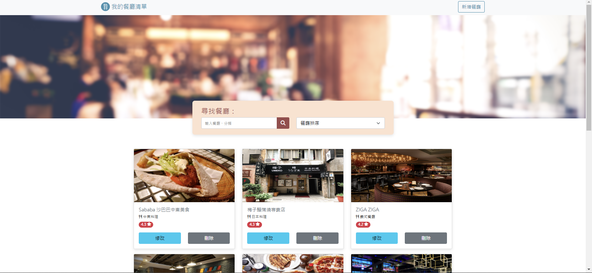

# 我的餐廳清單
This project is enable user to create their own restaurant list. 
The function include browsing the restaurant list, search restaurant, add restaurant, edit restaurant and delete restaurant


## Introduction
* User can browse the restaurant list
* User can search for the restaurant
* User can browse restaurant detail
* User could connect google map through restaurant address
* User could add new restaruant
* User could edit existing restaruant
* User could delete existing restaruant

## Develp Environment and Tools

* node.js @16.15.0
* express @4.18.2
* express-handlebars @7.1.2
* bootstrap @5.3.2
* mongodb @6.1.0
* mongoose @7.5.3
* dotenv @16.3.1
* method-override @3.0.0
* body-parser @1.20.2

## Getting Start

1. Clone the project to local, enter:

```
git clone https://github.com/tonia83731/new-RestaurantList.git
```

2. Go into the project(cd), later enter to install npm:

```
npm install
```

3. Start the project by enter:

```
npm run dev
```

4. If you wish to end the project, enter:

```
ctrl + c
```

## For Future Development

This is for future development, will not include in current project

* Fixed the filter function on index page
* Add pagination for index page

